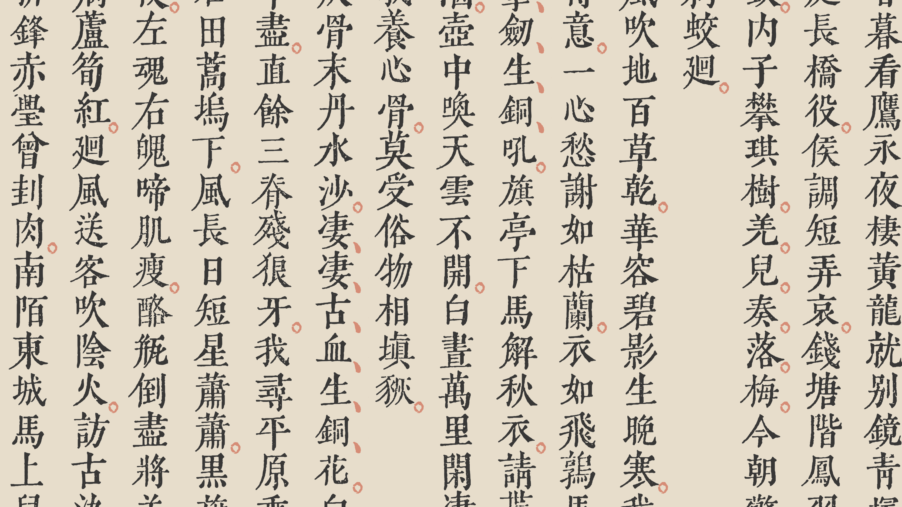

# 齊伋體 qiji-font

*Qiji-font (齊伋體)* is:

- A [Ming typeface](https://en.wikipedia.org/wiki/Ming_(typefaces));
- Extracted from Ming Dynasty woodblock printed books ([凌閔刻本](https://www.shuge.org/tag/minling/?post_type=ebook));
- Using semi-automatic computer vision and OCR;
- Open source;
- A work in progress;
- Named in honour of 閔齊伋, 16th century printer;
- Intended to be used with [wenyan-lang](//wy-lang.org), the Classical Chinese programming language.

📢 聲明：敝字體近日頗見流傳於網絡，然皆誤以“‘凌’东齐伋体”為名。鄙人名**令東**，字體名**齊伋**；強欲冠後以前者，亦以“**令東齊伋體**”為宜，望周知。🤦‍♂️

## [Try it out online!](https://qiji-font.netlify.com/)

## Download

- See [Releases](https://github.com/LingDong-/qiji-font/releases) page.

## Progress

| Unique Glyphs | Covered Characters* | Books Scanned |
|---|---|---|
|  4569 |  **5916** | [李長吉歌詩](https://www.shuge.org/ebook/li-changji-ge-shi/) / [淮南鴻烈解](https://www.shuge.org/ebook/huai-nan-hong-lie-jie/) |

* Simplified forms fall back to traditional forms, more common traditional variants fall back to less common variant forms.

## Workflow

**Step I:** Download high resolution PDFs (from [shuge.org](shuge.org)) and split pages into images.

**Step II:** Manually lay a grid on top of each page to generate bounding boxes for characters (potentially replacable by an automatic corner-detection algorithm).

**Step III:** Generate a low-poly mask for each character on the grid, and save the thumbnails (using [OpenCV](opencv.org)). First, red channel is subtracted from the grayscale, in order to clean the annotations printed in red ink. Next, the image is thresholded and fed into contour-tracing algorithm. A metric is then used to discard shapes that are unlikely to be part of the character in interest. (This step does not produce the final glyph, only a quick-and-dirty extraction for intermediate processing.)

**Step IV:** Feed each thumbnail one by one into neural-net Chinese OCR to recognize the characters (currently using [chineseocr/darknet-ocr](https://github.com/chineseocr/darknet-ocr), low detection rate, mediocre accuracy, very slow on CPU, looking for better alternatives).

**Step V:** Manually judge output of OCR: pick the best-looking instance of a given character, and flag incorrectly recognized characters.

**Step VI:** For the final character set, automatically generate fine raster rendering of each character. Each character is placed at its "visual" center by cumulatively counting pixels from left and right, as well as top and bottom, so that the "weight" of the character is on the centerlines, as opposed to centering the bounding box. Two thresholding methods are used, the global threshold is dilated and acts as a mask to the adaptive threshold, thus preserving details while blocking out surrounding boogers.

**Step VII:** Raster-to-vector tracing software [potrace](http://potrace.sourceforge.net) is used to convert the raster rendrings into SVG's. [FontForge's python library](https://fontforge.org/en-US/documentation/scripting/python/) is used to generate the final font file. Done!

As the number of characters grow, the above procedure is going to be less and less efficient, since new, previously unseen characters obtainable from each book processed are going to be rarer and rarer. An alternative method which involves clicking only on unseen characters to pick them out is under construction.

## Known Issues

- Character sizes are sometimes inconsistent. Undergoing manual tweaking.

## Development

**Requirements:**

- Python 3
- OpenCV Python (`pip3 install opencv-python`)
- FontForge Python library (included in `brew install fontforge`)
- Chinese OCR (e.g. [chineseocr/darknet-ocr](https://github.com/chineseocr/darknet-ocr))
- Raster-to-vector tracer (e.g. [potrace](http://potrace.sourceforge.net))

The main code is contained in `/workflow`, and corresponds to the steps described above. Documentation for the code is yet to be done (soon), so feel free to inquire if interested. As you might have noticed, there is a ton of work involved in making a Chinese font, so contribution is very much welcome :)

# Charset

Sheet of all unique glyphs sorted by unicode entry point, click to enlarge. (this is lossy JPEG, for full PNG, [check here](screenshots/sheet.png), for SVG, run `node workflow/make_sheet.js`)

